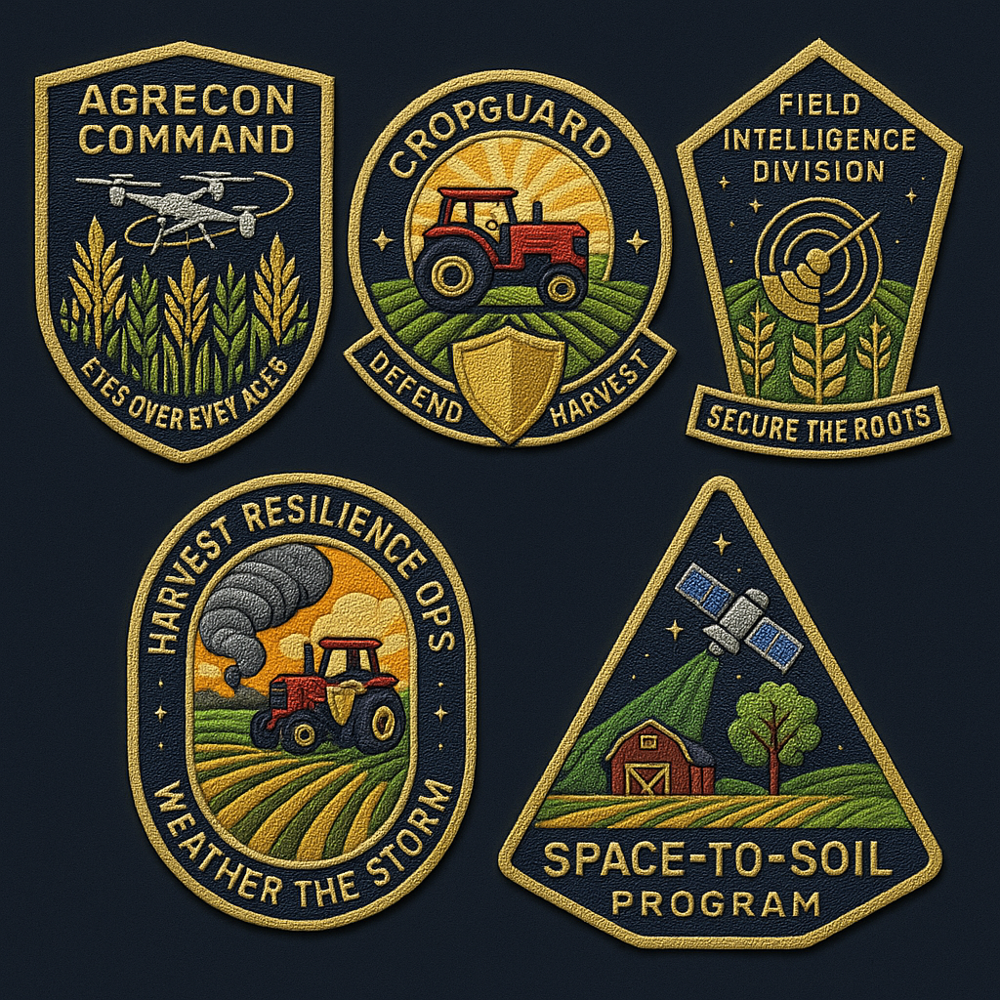

<div align="center">
  <h1>AgriDefender 3D - Agricultural Threat Detection & Response System</h1>
  <h2><a href="https://designdream.github.io/agri-defender-hackathon/" target="_blank">🚀 Live Demo</a> | <a href="https://app.typeset.com/play/NP094O/embed" target="_blank">📊 View Presentation Deck</a></h2>
</div>

AgriDefender 3D is a precision agriculture defense system for detecting, monitoring, and responding to crop threats. Using geospatial visualization techniques, it enables agricultural stakeholders to identify biological threats early, deploy automated drone countermeasures, and coordinate field response strategies through a comprehensive sensor network and threat intelligence platform.

## Table of Contents
- [Project Overview](#project-overview)
- [Architecture](#architecture)
- [Key Features](#key-features)
- [Getting Started](#getting-started)
- [Technologies Used](#technologies-used)
- [Technical Highlights](#technical-highlights)
- [API Integration Guide](#api-integration-guide)
- [Future Enhancements](#future-enhancements)
- [Acknowledgments](#acknowledgments)
- [License](#license)

<div align="center">
  
</div>

## Project Overview

AgriDefender 3D provides a comprehensive crop defense platform with the following technical capabilities:

1. **Multi-spectrum Threat Detection** - Sensor fusion technology integrating soil readings, optical data, and environmental parameters for early pathogen identification
2. **Threat Classification System** - Machine learning-based pathogen identification (bacterial, fungal, viral, pest) with severity assessment algorithms
3. **Automated Countermeasure Deployment** - Precision drone deployment system with treatment delivery capabilities based on threat assessment
4. **Distributed Sensor Network** - Multi-node sensor grid for continuous field monitoring with anomaly detection algorithms
5. **Geospatial Defense Planning** - Tactical response visualization with containment zone mapping and treatment effectiveness tracking

## Architecture

The application is structured as follows:

```
├── src/
│   ├── dashboard/           
│   │   ├── 3d_visualization/  # Three.js 3D visualization
│   │   │   ├── js/           # JavaScript modules for visualization
│   │   │   │   ├── field-data.js        # Field, threat, drone & sensor data generation
│   │   │   │   ├── main.js              # Core Three.js setup and rendering
│   │   │   │   ├── threat-visualization.js # Threat visualization with 3D bubbles
│   │   │   │   └── ui-controls.js       # User interface and control handling
│   │   │   ├── index.html    # Main 3D visualization interface
│   │   │   └── styles.css    # Styling for the visualization interface
├── AgriDefender_3D.pdf       # Presentation slides
└── NARD.png                  # Logo of the fictional NARD organization
```

## Key Features

### 1. Multi-spectrum Threat Detection

**Feature:** Early identification system for crop pathogens using multi-parameter sensor data analysis.

**Implementation:**
- Technologies: Sensor fusion algorithms, anomaly detection systems
- Key files: `field-data.js`, `threat-detection.js`
- Technical specifications:
  - Multi-parameter correlation analysis (soil chemistry, moisture, temperature)
  - Threshold-based anomaly detection with adaptive baseline calibration
  - Spatiotemporal pattern recognition for spread prediction
  - Sub-surface pathogen detection capabilities via soil composition analysis

### 2. Threat Classification System

**Feature:** Machine learning-based identification and classification of agricultural threats with severity assessment.

**Implementation:**
- Technologies: Convolutional neural networks, classification algorithms
- Key file: `threat-classification.js`
- Technical specifications:
  - Multi-class pathogen identification (bacterial, fungal, viral, arthropod)
  - Severity quantification using gradient-based assessment (low, medium, high)
  - Confidence scoring with uncertainty estimation
  - Taxonomic classification with species-level identification capabilities

### 3. Automated Countermeasure Deployment

**Feature:** Precision drone-based agricultural defense system with autonomous treatment delivery capabilities.

**Implementation:**
- Key files: `drone-control.js`, `countermeasure-deployment.js`
- Technical specifications:
  - Path optimization algorithms for efficient field coverage
  - Treatment delivery system with precision application capabilities
  - Dynamic mission planning based on threat severity and distribution
  - Autonomous obstacle avoidance and weather condition adaptation
  - Real-time telemetry for operational monitoring

### 4. Distributed Sensor Network

**Feature:** Multi-node field monitoring system with distributed intelligence for continuous agricultural surveillance.

**Implementation:**
- Key files: `sensor-network.js`, `data-aggregation.js`
- Technical specifications:
  - Heterogeneous sensor array (soil chemistry, moisture, temperature, optical)
  - Mesh network architecture with redundant communication pathways
  - Edge computing capabilities for localized data processing
  - Power optimization algorithms for extended deployment longevity
  - Data compression and prioritization for bandwidth efficiency

### 5. Geospatial Defense Planning

**Feature:** Tactical response coordination system with containment strategies and treatment effectiveness monitoring.

**Implementation:**
- Key files: `defense-planning.js`, `containment-strategies.js`
- Technical specifications:
  - Quarantine zone calculation based on pathogen transmission characteristics
  - Treatment protocol selection system with efficacy prediction
  - Multi-stage response planning for progressive containment
  - Resource allocation optimization for defensive operations
  - Impact assessment algorithms for defensive strategy evaluation

## Getting Started

### Prerequisites

- Modern web browser with WebGL support (Chrome, Firefox, Edge recommended)
- Basic HTTP server capability (Python's built-in server or equivalent)

### Installation

1. Clone the repository:
```bash
git clone https://github.com/designdream/agri-defender-hackathon.git
cd agri-defender-hackathon
```

2. Start a local web server:
```bash
python -m http.server 9000
```

3. Open your browser and navigate to:
```
http://localhost:9000/src/dashboard/3d_visualization/index.html
```

### System Operation

1. Use the View Mode controls to switch between Tactical Overview, Field Inspection, and Drone Monitoring views
2. For field navigation, the system supports the 8BitDo Micro gaming controller in keyboard mode
3. Select detected threats to access detailed pathogen information and treatment protocols
4. Interact with sensors to view environmental parameters and system diagnostics

## Technologies Used

- **Three.js**: Core 3D visualization engine for rendering fields, threats, drones, and sensors
- **JavaScript ES6+**: Modern JavaScript with modules for code organization
- **GSAP (GreenSock Animation Platform)**: Advanced animation for smooth transitions and effects
- **WebGL**: Hardware-accelerated graphics rendering for performance
- **CSS3**: Styling with advanced effects including backdrop filters
- **HTML5**: Semantic markup for the interface structure

## Technical Highlights

### Pathogen Detection Algorithms

The threat detection system uses sophisticated algorithms to identify potential crop pathogens based on multi-parameter analysis:

```javascript
function analyzePathogenProbability(sensorData) {
    // Extract key indicators from sensor data
    const { moisture, temperature, pH, conductivity, nitrogen } = sensorData.readings;
    
    // Calculate environmental favorability for different pathogen types
    const bacterialFavorability = calculateBacterialGrowthPotential(temperature, moisture, pH);
    const fungalFavorability = calculateFungalGrowthPotential(temperature, moisture);
    const viralTransmissionRisk = calculateViralTransmissionRisk(temperature, moisture, nitrogen);
    
    // Analyze chemical composition indicators
    const chemicalAnomalies = detectChemicalAnomalies(pH, conductivity, nitrogen);
    
    // Correlate indicators to determine threat probability
    return {
        bacterialThreatProbability: bacterialFavorability * chemicalAnomalies.bacterial,
        fungalThreatProbability: fungalFavorability * chemicalAnomalies.fungal,
        viralThreatProbability: viralTransmissionRisk * chemicalAnomalies.viral,
        confidence: calculateConfidenceScore(sensorData)
    };
}
```

### Containment Zone Calculation

The system uses epidemiological models to determine optimal containment strategies based on pathogen characteristics:

```javascript
function calculateContainmentParameters(threat) {
    // Retrieve pathogen-specific transmission parameters
    const pathogenProfile = getPathogenProfile(threat.type);
    
    // Calculate spread rate based on environmental conditions
    const baseReproductionNumber = pathogenProfile.baseReproductionRate;
    const environmentalModifier = calculateEnvironmentalModifier(
        currentField.moisture, 
        currentField.temperature, 
        currentField.plantDensity
    );
    
    // Determine effective reproduction number
    const effectiveReproductionNumber = baseReproductionNumber * environmentalModifier;
    
    // Calculate minimum containment radius using epidemiological model
    const minContainmentRadius = Math.sqrt(threat.affectedArea / Math.PI) * 
                               (1 + effectiveReproductionNumber) * 
                               pathogenProfile.safetyFactor;
    
    return {
        recommendedRadius: minContainmentRadius,
        treatmentProtocol: selectTreatmentProtocol(threat.type, threat.severity),
        requiredResources: calculateResourceRequirements(minContainmentRadius, threat.type),
        estimatedContainmentTime: calculateContainmentTime(threat, effectiveReproductionNumber)
    };
}
```

## API Integration Guide

AgriDefender 3D is designed to integrate with real-world data sources through standardized APIs. This guide outlines the implementation details for connecting sensors, drones, and threat detection systems to the visualization platform.

### Sensor Data API

**Purpose:** Collect and process real-time data from field sensors for visualization.

**API Endpoints:**

```
GET /api/v1/sensors - List all sensors
GET /api/v1/sensors/{sensor_id} - Get specific sensor details
POST /api/v1/sensors/data - Submit new sensor reading
GET /api/v1/sensors/data/{sensor_id} - Get historical readings
```

**Data Format Example:**

```json
{
  "sensor_id": "soil-sensor-0042",
  "timestamp": "2025-04-27T17:30:22Z",
  "location": {"x": 156.3, "y": 0.3, "z": 78.2},
  "type": "SOIL",
  "readings": {
    "moisture": 37.8,
    "temperature": 22.5,
    "pH": 6.8,
    "nitrogen": 42,
    "conductivity": 0.38
  },
  "battery": 87,
  "status": "ACTIVE"
}
```

**Integration Implementation:**

```javascript
// In field-data.js
async function fetchSensorData() {
  try {
    const response = await fetch('https://api.agridefender.io/v1/sensors');
    if (!response.ok) throw new Error('Network response failed');
    
    const sensors = await response.json();
    return sensors.map(sensor => ({
      id: sensor.sensor_id,
      type: sensor.type,
      location: { x: sensor.location.x, y: sensor.location.y, z: sensor.location.z },
      readings: sensor.readings,
      status: sensor.status,
      lastUpdated: new Date(sensor.timestamp)
    }));
  } catch (error) {
    console.error('Error fetching sensor data:', error);
    return fallbackSensorData(); // Use local data if API fails
  }
}
```

### Drone Control API

**Purpose:** Monitor and control autonomous drones for field surveillance.

**API Endpoints:**

```
GET /api/v1/drones - List all drones
GET /api/v1/drones/{drone_id} - Get specific drone status
POST /api/v1/drones/{drone_id}/mission - Assign patrol mission
GET /api/v1/drones/{drone_id}/telemetry - Get real-time telemetry
```

**Data Format Example:**

```json
{
  "drone_id": "patrol-drone-007",
  "model": "AgriScout X2",
  "status": "PATROL",
  "battery": 76,
  "location": {"x": 423.1, "y": 45.8, "z": 216.4},
  "speed": 5.2,
  "heading": 283,
  "altitude": 45.8,
  "mission": {
    "id": "mission-2025-04-27-12",
    "type": "PATROL",
    "waypoints": [
      {"x": 400, "y": 45, "z": 200},
      {"x": 450, "y": 45, "z": 200},
      {"x": 450, "y": 45, "z": 250},
      {"x": 400, "y": 45, "z": 250}
    ],
    "progress": 68
  }
}
```

**Integration Implementation:**

```javascript
// In field-data.js
async function fetchDroneData() {
  try {
    const response = await fetch('https://api.agridefender.io/v1/drones');
    if (!response.ok) throw new Error('Network response failed');
    
    const drones = await response.json();
    return drones.map(drone => ({
      id: drone.drone_id,
      model: drone.model,
      status: drone.status,
      location: { x: drone.location.x, y: drone.location.y, z: drone.location.z },
      battery: drone.battery,
      patrolPath: drone.mission?.waypoints || [],
      currentWaypoint: Math.floor((drone.mission?.progress || 0) / 100 * 
                     (drone.mission?.waypoints?.length || 1))
    }));
  } catch (error) {
    console.error('Error fetching drone data:', error);
    return fallbackDroneData(); // Use local data if API fails
  }
}
```

### Threat Detection API

**Purpose:** Process and visualize detected agricultural threats.

**API Endpoints:**

```
GET /api/v1/threats - List all detected threats
GET /api/v1/threats/{threat_id} - Get specific threat details
POST /api/v1/threats - Report a new threat
PUT /api/v1/threats/{threat_id}/status - Update threat status
```

**Data Format Example:**

```json
{
  "threat_id": "threat-2025-04-27-036",
  "name": "Powdery Mildew Infection",
  "type": "Fungal",
  "severity": "High",
  "location": {"x": 256.7, "y": 0.2, "z": 189.3},
  "affectedArea": 78.5,
  "detectedDate": "2025-04-27T09:45:18Z",
  "detectionMethod": "SENSOR",
  "detectedBy": "soil-sensor-0028",
  "confidence": 0.94,
  "status": "ACTIVE",
  "progression": 0.35,
  "description": "White powdery substances on crop leaves with signs of spreading to nearby plants.",
  "recommendedActions": [
    "Apply organic fungicide immediately",
    "Increase plant spacing in affected area",
    "Reduce overhead irrigation"
  ]
}
```

**Integration Implementation:**

```javascript
// In threat-visualization.js
async function fetchThreatData() {
  try {
    const response = await fetch('https://api.agridefender.io/v1/threats');
    if (!response.ok) throw new Error('Network response failed');
    
    const threats = await response.json();
    return threats.map(threat => ({
      id: threat.threat_id,
      name: threat.name,
      type: threat.type,
      severity: threat.severity,
      location: { x: threat.location.x, y: threat.location.y, z: threat.location.z },
      affectedArea: threat.affectedArea,
      detectedDate: threat.detectedDate,
      confidence: threat.confidence,
      status: threat.status,
      description: threat.description,
      recommendations: threat.recommendedActions
    }));
  } catch (error) {
    console.error('Error fetching threat data:', error);
    return fallbackThreatData(); // Use local data if API fails
  }
}
```

### Webhook Integration for Real-time Updates

For real-time updates, AgriDefender 3D uses WebSockets to receive push notifications when new data is available:

```javascript
// In main.js
function initializeRealTimeUpdates() {
  const wsProtocol = window.location.protocol === 'https:' ? 'wss:' : 'ws:';
  const socket = new WebSocket(`${wsProtocol}//api.agridefender.io/v1/websocket`);
  
  socket.onopen = () => {
    console.log('WebSocket connection established');
    // Subscribe to relevant data channels
    socket.send(JSON.stringify({
      action: 'subscribe',
      channels: ['sensors', 'drones', 'threats']
    }));
  };
  
  socket.onmessage = (event) => {
    const data = JSON.parse(event.data);
    
    // Handle different types of updates
    switch (data.type) {
      case 'sensor_update':
        updateSensorData(data.payload);
        break;
      case 'drone_update':
        updateDronePosition(data.payload);
        break;
      case 'threat_detected':
        addNewThreat(data.payload);
        break;
      case 'threat_update':
        updateThreatStatus(data.payload);
        break;
    }
  };
  
  socket.onerror = (error) => {
    console.error('WebSocket error:', error);
  };
  
  socket.onclose = () => {
    console.log('WebSocket connection closed');
    // Attempt to reconnect after a delay
    setTimeout(initializeRealTimeUpdates, 5000);
  };
}
```

## Future Enhancements

Planned agricultural defense capabilities:

1. **Predictive Pathogen Modeling**: Neural network-based prediction of outbreak probability using historical and environmental data
2. **Automated Biological Control Deployment**: Integration with beneficial organism deployment systems for sustainable pest management
3. **Genomic Analysis Module**: Pathogen strain identification through field-deployable genomic sequencing
4. **Chemical Resistance Prediction**: Machine learning algorithms to assess potential treatment resistance and recommend mitigation strategies
5. **Satellite Integration**: Fusion of satellite imagery with ground sensor data for macro-level threat detection

## Acknowledgments

This project was developed at the National Security Hackathon (April 26-27, 2025) with support from:

- [Shack15](https://www.shack15.com/) - For providing an innovative space for hackers and dreamers
- [Cerebral Valley](https://www.cerebralvalley.ai/) - For pushing the boundaries of AI in national security
- [Gordian Knot Center for National Security Innovation](https://gordianknot.stanford.edu/) at Stanford University
- [SHIELD Capital](https://www.shield.vc/)
- [SHACK15](https://www.shack15.com/)
- [NIF Ventures](https://www.nif.vc/)
- [IQT](https://www.iqt.org/)
- [Scale AI](https://scale.com/)
- [Vannevar Labs](https://www.vannevarlabs.com/)

Special thanks to:
- Three.js community for development resources and examples
- Agricultural defense researchers for domain expertise
- All the volunteers and mentors who made the hackathon possible

## License

This project is licensed under the MIT License - see the LICENSE file for details.


